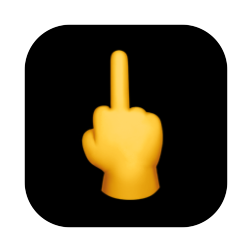

<p align="center">
  
</p>

<h1 align="center">ThockYou</h1>

<p align="center">
  A macOS app that plays mechanical keyboard typing sounds as you type.
</p>

<p align="center">
  <strong>English</strong> ・ <a href="README.ja.md">日本語</a>
</p>

<p align="center">
  
  
  
</p>

---

ThockYou lives in your menu bar and plays sampled keyboard sounds in response to global key-down events, with low latency through `AVAudioEngine`. It ships with Mechvibes-compatible atlas sound packs so you can pick the switch profile you like.

## Features

- Menu-bar resident, with enable/disable from the settings window
- Global keyboard monitoring across all apps
- Low-latency playback via `AVAudioEngine` and a pool of player nodes
- Bundled sound packs
  - CherryMX Black / Blue / Brown / Red — PBT keycaps
  - Everglide Oreo
  - Everglide Crystal Purple
- Load any folder of audio files as a custom sound pack
- Adjustable volume and pitch jitter

## Requirements

- macOS 13 or later
- Swift 6 / Xcode Command Line Tools

## Build & run

Building a `.app` bundle is recommended — `swift run` tends to attach the Accessibility permission to Terminal instead of the app.

```bash
make open
```

This invokes `Scripts/build_app.sh`, which builds the binary, copies `Resources/` into the bundle, and applies an ad-hoc signature for local use. Distributing the app requires a Developer ID signature and notarization (not configured here).

To build only:

```bash
swift build
# or
./Scripts/build_app.sh
open .build/ThockYou.app
```

## Accessibility permission

ThockYou needs the **Privacy & Security → Accessibility** permission in System Settings to receive global key-down events from every app. Only key-down event metadata is read — typed characters are never stored or transmitted.

After granting permission, click **Recheck** in the settings window or relaunch the app. If older builds named `Keysound` or `Thockyou` remain in the Accessibility list, remove them and authorize the new `ThockYou` entry.

## Custom sound packs

Point ThockYou at a folder of short `.wav`, `.aiff`, `.caf`, `.m4a`, or `.mp3` files. For each keypress, one matching file is chosen at random.

Filenames containing the following words are treated as special-key sounds:

- `space`
- `enter` or `return`
- `delete` or `backspace`
- `shift`, `cmd`, `command`, `control`, `option`, `alt`

Anything else is treated as a regular-key sound.

Mechvibes-style atlas packs (single audio file + `config.json`) can also be added by dropping them into `Resources/SoundPacks/` and registering an entry in `SoundPackCatalog` (`Sources/ThockYou/SoundPack.swift`).

## Acknowledgements

The bundled sound packs and configuration JSON are derived from [Mechvibes](https://github.com/hainguyents13/mechvibes) (MIT License, Copyright (c) 2021 Hai Nguyen). Huge thanks to that project for publishing such great recordings.

## License

ThockYou itself is distributed under the MIT License — see [`LICENSE`](LICENSE).

The bundled sound packs in `Resources/SoundPacks/` are redistributed under the MIT License from upstream. See [`THIRD_PARTY_LICENSES.md`](THIRD_PARTY_LICENSES.md) for attribution and the full license text.

Cherry MX is a trademark of Cherry GmbH; Everglide is a trademark of its respective owner. ThockYou is not affiliated with, endorsed by, or sponsored by these companies. Product names are used solely to identify the keyboard switches whose sounds the bundled audio packs emulate.
